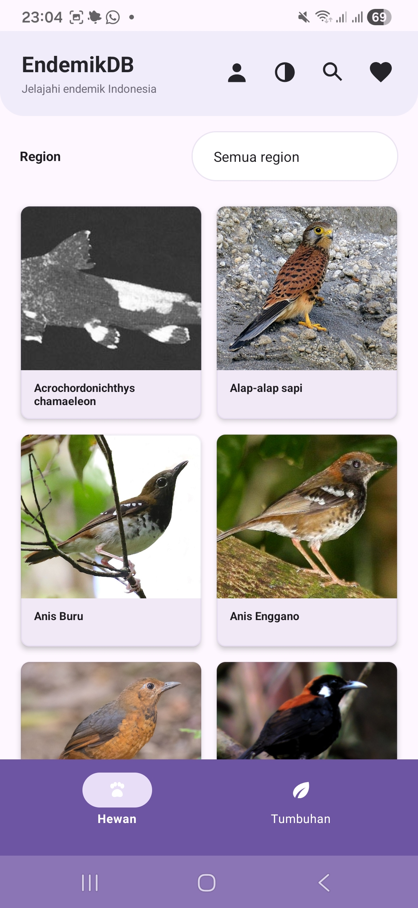
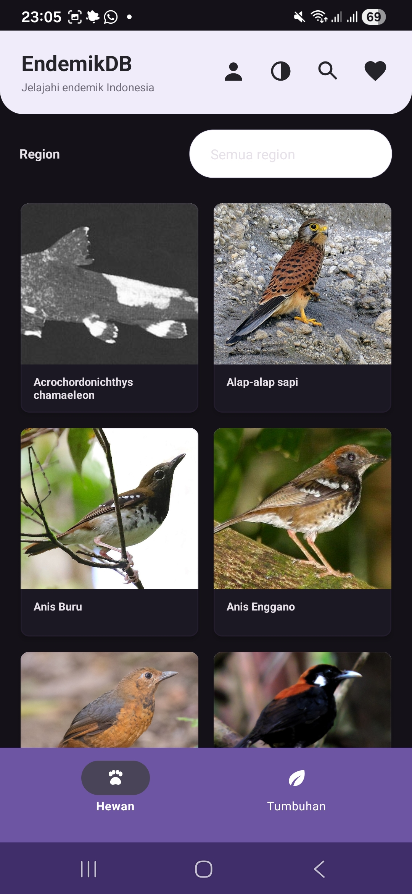
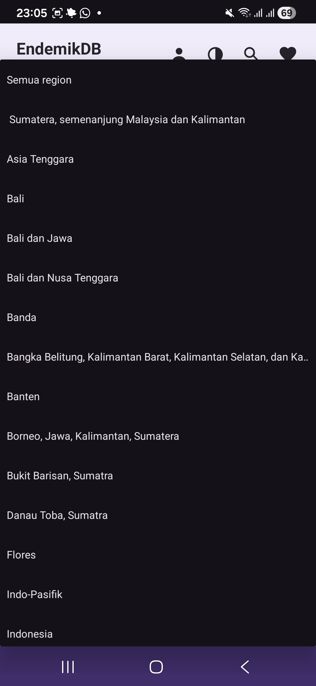
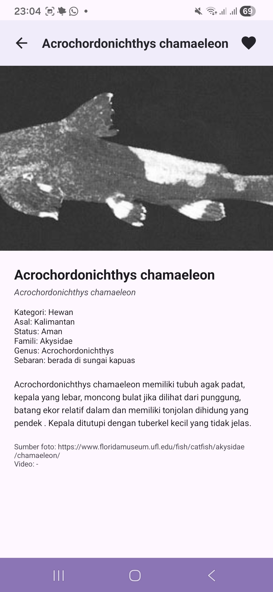
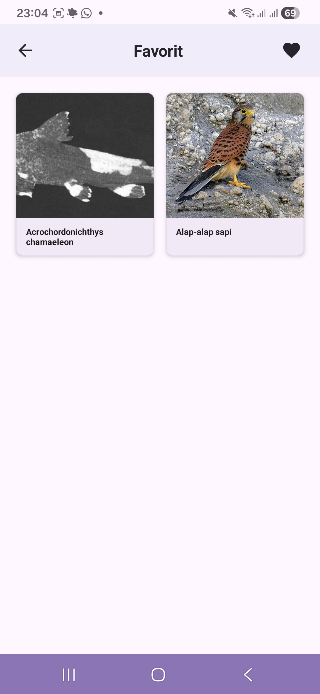
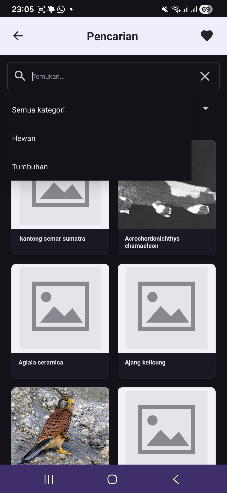
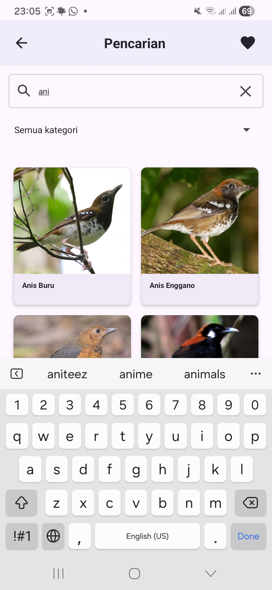

# EndemikDB

EndemikDB adalah aplikasi Android native Java/XML untuk menampilkan data hewan dan tumbuhan endemik Indonesia. Data diambil dari API, disimpan ke Room database, lalu bisa dibuka kembali secara offline setelah data pertama kali tersimpan.

## Identitas

- Nama: Benita Aryani
- NIM: 2410501023

## Fitur

- Splash screen untuk mengambil data awal dari API.
- Cache offline menggunakan Room database `endemikDB`.
- Home dengan kategori Hewan dan Tumbuhan.
- Filter region berdasarkan asal/sebaran data.
- Pencarian berdasarkan nama, nama latin, asal, status, dan deskripsi.
- Detail data endemik dengan foto, kategori, asal, status, famili, genus, sebaran, dan deskripsi.
- Favorit untuk menyimpan data pilihan.
- Tema light dan dark mode.
- Popup profile berisi identitas dan foto.

## Teknologi

- Android native Java/XML
- Room
- Retrofit dan Gson
- Glide
- Material Components

## Screenshot

### Home Light Mode

Tampilan utama menampilkan data endemik dalam grid dua kolom, pilihan region, tombol profile, tema, pencarian, dan favorit.



### Home Dark Mode

Aplikasi mendukung dark mode dengan komponen yang tetap terbaca dan bottom navigation untuk Hewan/Tumbuhan.



### Filter Region

Filter region digunakan untuk menyaring data berdasarkan field asal/region yang tersimpan di Room.



### Detail Data

Halaman detail menampilkan informasi lengkap item endemik dan tombol favorit.



### Favorit

Halaman favorit menampilkan item yang sudah disimpan dari detail.



### Pencarian Dark Mode

Pencarian dapat digunakan untuk mencari data berdasarkan keyword dan kategori.



### Pencarian Light Mode

Hasil pencarian tetap tampil dalam bentuk grid dan mendukung keyboard input di perangkat.



## Cara Menjalankan

1. Buka project ini di Android Studio.
2. Pastikan perangkat/emulator memiliki internet untuk fetch data pertama kali.
3. Jalankan app dari Android Studio atau build dengan:

```powershell
.\gradlew.bat assembleDebug
```

APK debug akan dibuat di:

```text
app/build/outputs/apk/debug/app-debug.apk
```
